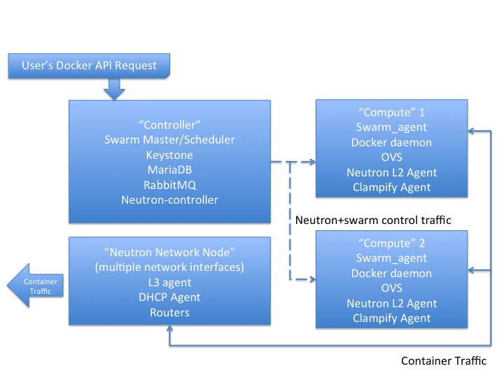

# Introduction:

Clampify gives you the ability to setup multiple isolated networks across the nodes in a Swarm cluster. This can be leveraged to put containers of different workloads belonging to the same user in different networks, or a building block towards a multi-tenant clustering solution, where containers of different tenants get hooked into isolated networks. In addition to Docker and Swarm, this solution utilizes two components of the Openstack project - Keystone (for user authentication and authorization) and Neutron (the powerful networking component that gives us multi-tenancy). Neutron is a large project with many different features such as loadbalancers-as-a-service, firewall-as-a-service, etc. Neutron is also designed as a plugin architecture, so it can leverage a variety of physical and software switches depending on the circumstances. For all my work to date, I've utilized OpenVswitch aka OVS (supported by Neutron's ML2 plugin).

# Setup:

To get things going, you need some machines. They can be baremetal machines (e.g. baremetal hosts in Softlayer) or Virtual Machines (e.g. IBM Bluemix VMs, Softlayer CCIs, instances in AWS). The key requirement for setting a swarm cluster is that the machines need to have network connectivity. All my initial development work has utilized Ubuntu 14.04. Starting from a fresh host, I first install the latest version of Docker (I suggest 1.6 or higher to get support for labels). Next, you need to setup the two pieces of Openstack we need: Keystone and Neutron. I won't cover the details of how to do this in this initial post but might give more details if people are having trouble with it. FWIW, I just followed the instructions in the Openstack Juno Install Guide for Ubuntu 14.04. Specifically, I installed all the core Openstack pieces - middleware (MariaDB and RabbitMQ), Keystone and Neutron servers on the same node as where I run my Swarm master. If you want HA, etc. you can of course, run these in pieces in more complicated configurations. On my Swarm minion nodes, I have the Docker Daemon and the Swarm Agent running of course, some pieces related to Neutron (OVS and the Neutron L2 agent) and finally the Clampify agent. The job of the Clampify agent is similar to the setup done by the nova-docker driver in nova-compute. Of course, the point here is that we want similar functionality (e.g. ability to utilize the Neutron overlay) but without using Nova. The following image shows how all these pieces fit together:

We assume we have a controller/network node that has some Openstack components setup on it. Specifically, the initial prototype uses Openstack Juno, and uses MariaDB as the Openstack DB and Rabbit MQ as the messaging platform. For networking, we utilize OVS and GRE. We followed the Basic Environment, Identity Service and Networking Component instructions for Openstack installation:
http://docs.openstack.org/juno/install-guide/install/apt/content/

# Dependencies:

You will need:

Go (version 1.4)

Openstack CLIs

A file named openrc in the current user's home directory with Openstack creds.

# Instructions/Demo:

There are two ways to use Clampify. First, you can use it as a CLI tool to create/delete VIFs and attach them to a Docker container. Second, you can run Clampify as an agent. In this mode, it will watch the stream of events being published by the Docker Daemon and add an interface to the container hooked into an exisiting Neutron network.

### Clampify as a CLI tool:

#### To create a VIF, provide the name of a neutron network and an arbitrary name to use for the network namespace:

root@vizio-devswarm-host1:~/gocode/src/github.rtp.raleigh.ibm.com/clampify# go run clampify.go create demo-net blue

#### To delete a previously created VIF, provide the port ID of the corresponding Neutron port and the name of the network namespace:

go run clampify.go delete 64f4d2de-fa88-4238-8c51-045cea76aed4 blue

#### To check if things are working:
(on the compute node, run:)
(this will run a python webserver on port 8000 inside the network namespace)
ip netns exec blue python -m SimpleHTTPServer

(on the network node, run:)
(of course, use the corresponding router namespace and IP address for the port you just created)
ip netns list

qdhcp-d3271615-704e-4ead-aae8-24e70e7c4f4c

qprobe-aeaed304-ca88-471e-b255-57550f66d1ae

qrouter-28d266f5-c9f9-40f3-8a07-c11dcae13d53

ip netns exec qrouter-28d266f5-c9f9-40f3-8a07-c11dcae13d53 telnet 192.168.1.15 8000

#### Create a neutron port and attach it to a docker container

go run clampify.go insert demo-net 7bfbd1af154d246fd3e5405eb7893e3a06682944148b15af4d11192b97d2d393

First argument to cli is the command (insert), followed by the neutron network name (demo-net in this case) and then the container id

#### If you stopped a docker container, and start it again, it seems to lose connectivity. This is how to restore it on the same neutron port:

go run clampify.go reinsert 7bfbd1af154d246fd3e5405eb7893e3a06682944148b15af4d11192b97d2d393 8ebbcf7f-1995-494f-89b7-0714fdacb9a2 192.168.1.22

First argument to cli is the command (reinsert), followed by the container id, the neutron port id and the IP address

### Clampify as an agent:

go run clampify.go watch demo-net

The above command must be run on every compute node/minion. The final argument is the name of the Neutron network to which all containers created on this host will be attached to. In the future, we expect to change this so that more fine grain control can be provided.
